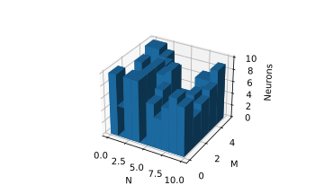

# Sequence learning
This repository contains the code base for the bachelor's thesis "Dynamic memory traces for sequence learning in spiking networks" at RWTH Aachen University/FZ Juelich INM-6 (Computation in Neural Circuits Group).

## Overview
- `klampfl-maass` contains the original code base for ["Emergence of Dynamic Memory Traces in Cortical Microcircuit Models through STDP" (2013)](https://doi.org/10.1523/jneurosci.5044-12.2013) that was replicated with NEST here
- `neuron-synapse-model` contains the custom neuron and synapse model for NEST that is required to run the simulation correctly
- `sequence-learning` is the actual Python package that contains the code for this project
- `thesis` contains the LaTeX source code of the corresponding thesis, along the thesis as pdf

## Requirements
In order to run the `sequence-learning` package, NEST (ideally [master@7086c3cab](https://github.com/nest/nest-simulator/tree/7086c3cabb8923efd2ca783da02e8253ecfde865)) is required, as well as the Python packages from `requirements-NEST.txt`. It is recommended to use conda/miniconda for this.
The `neuron-synapse-model` may also need to be compiled using ``make -j 4 install``.

## Getting Started
To get started, you can find in the `sequence-learning` package an `example.py` file that shows a use-case example. Also try running it to verify your installation is working correctly.

First of all (after importing the package) the NEST simulator needs to be initialized and the custom neuron and synapse model needs to be imported and installed by running
```
nest_init()
```

To create a new Network object use 
```
grid = Network(grid_shape=(10,5), k_min=2, k_max=10, n_inputs=100)
```
This creates a 2D grid of dimension `grid_shape` with each point on that grid representing a WTA circuit with a random number of neurons, drawn uniformly from [`k_min`, `k_max`]. The number of input channels is denoted by `n_inputs`. Many other parameters of the Network object can be manipulated. To find out more you can check out the code documentation within the `Network` class.
It is also possible to visualize the Network grid both as a 2D colormesh and a 3d barchart using
```python
grid.visualize_circuits()
```
and 
```python
grid.visualize_circuits_3d_barchart()
```
respectively.




Before actually running the Network the `max_neuron_gid` has to be set to the maximum global id of the Networks NodeCollection to ensure proper interaction between the Python code and the NEST kernel.
```python
grid.get_node_collections().max_neuron_gid = max(grid.get_node_collections().global_id)  # critical
```

A new InputGenerator object for the Network can be set up by running
```python
inpgen = InputGenerator(grid, r_noise=5, r_input=5, r_noise_pattern=2, use_noise=True, t_noise_range=[500.0, 800.0],
                        n_patterns=2, t_pattern=[300.]*2, pattern_sequences=[[0],[1]])
```
As with the Network class, the InputGenerator class documentation can be checked out for more information. In this example, the noise, input and noise-pattern firing rates (`r_noise`, `r_input`, `r_noise_pattern`) are set, as well as the time span from which the noise will be randomly drawn (`t_noise_range`). The patterns that will be produced by the InputGenerator are described by how many distinct patterns should exist (`n_patterns`), how long the duration of each of these patterns should be (`t_pattern`), and which sequences from these patterns should be run.

To run the actual simulation and record from it, a Recorder object is required
```python
recorder = Recorder(grid, save_figures=False, show_figures=True, create_plot=False)
```
The properties of the recorder can be set while the simulation is not running by `recorder.set()`. E.g.:
```python
recorder.set(create_plot=True)
```
To run a simulation and also obtain the `id`'s of the recorded neurons run
```python
id_list = recorder.run_network(inpgen=inpgen, t_sim=3000, dt_rec=None, title="Test #1", train=True, order_neurons=False)
```
The `id_list` can later be used to record from the same neurons as in previous simulation runs. To learn more about the different ways of sampling neurons to record from check out the documentation of the `run_network()` function. Sampling is especially useful when dealing with larger networks that can take up significant time for plotting etc.
The simulation time in ms is set by `t_sim`, and the time intervals in which EPSPs and weights should be recorded are given by `dt_rec`. It can also be decided if the Network should be allowed to learn during the simulation run or not (STDP on/off). To make neuron assemblies visible more easily `order_neurons` should be set to True to order the spike traces by mean activation time.